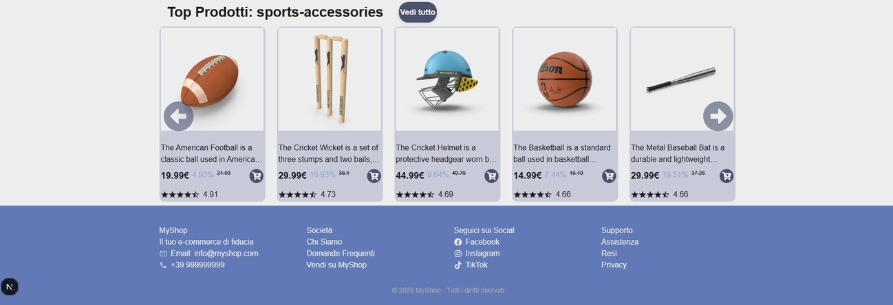
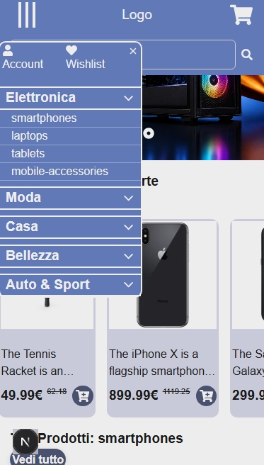

# 🛒 NextStore (Work in Progress)

A modern e-commerce application built with **Next.js**, designed to simulate a real-world online store with scalable architecture and clean UI.

> ⚠️ This project is currently under active development. Phase 1 has been completed.

---

## 🚀 Tech Stack

- Next.js (App Router)
- React
- TypeScript
- Axios (API integration)
- CSS Modules

---

## 📦 Features (Phase 1)

- Responsive Homepage layout  
- Hero section with highlighted products  
- Reusable Product Cards  
- Functional Navbar navigation  
- External API integration using Axios  
- Basic project structure for scalability  

---

## 🧠 Project Structure

The project is being developed in structured phases:

### 🔵 Phase 1 — Base & Setup ✅
- Next.js setup and architecture  
- Homepage layout (Hero, Navbar, Cards)  
- API integration (Axios)  
- Initial UI design  

---

### 🟡 Phase 2 — Pages & Navigation ✅
- Dynamic Hero banner  
- Category pages  
- Product detail page  
- Improved navigation UX  

---

### 🟠 Phase 2.5 — Internal API & Custom Data Source ✅
- Creation of internal API routes using Next.js  
- Enhancement of external API data to better fit application needs  
- Integration of internal API within the product detail page   

---

### 🔴 Phase 3 — State Management & Features (in progress)
- Redux Toolkit integration  
- Cart system  
- Wishlist system  
- Product search  
- Pagination  

---

## 🎯 Goals

This project is focused on:

- Building a real-world scalable application  
- Practicing state management and architecture  
- Improving UI/UX consistency  
- Simulating production-level frontend development  

---

## 📸 Preview

### 🏠 Homepage (Desktop)


### 🛒 Product Sections


### 🔚 Footer Section


### 📱 Mobile View


---

## ⚙️ Installation

```bash
git clone https://github.com/ManuelCappai94/NextStore.git
cd NextStore
npm install
npm run dev